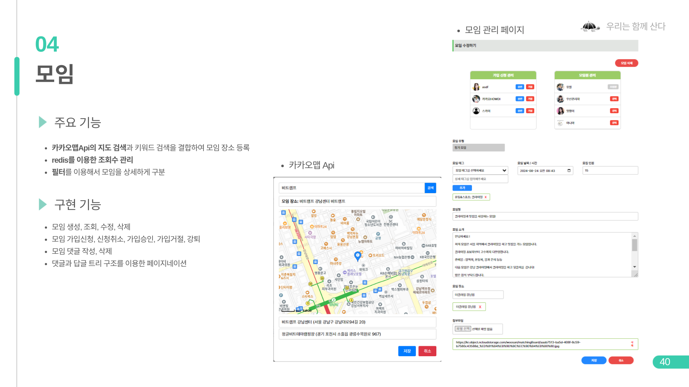
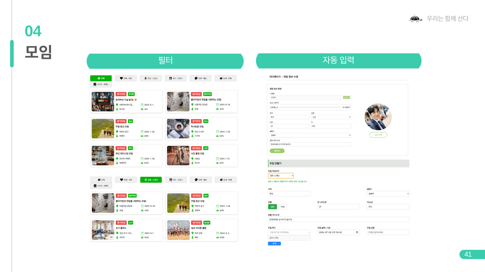
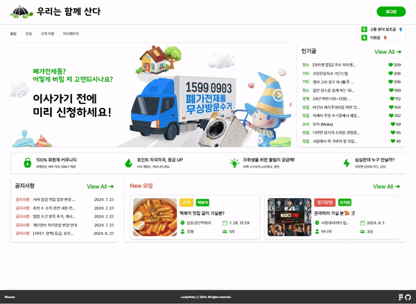
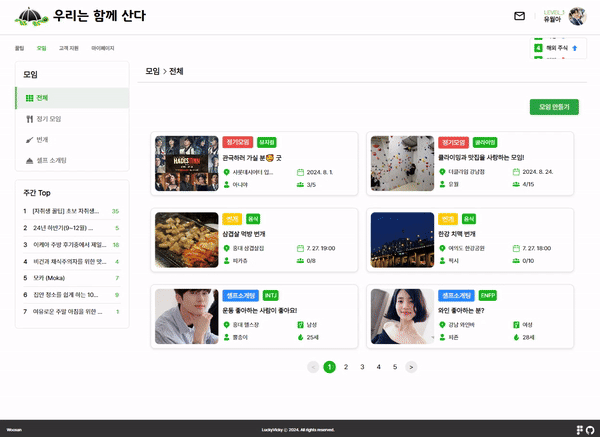
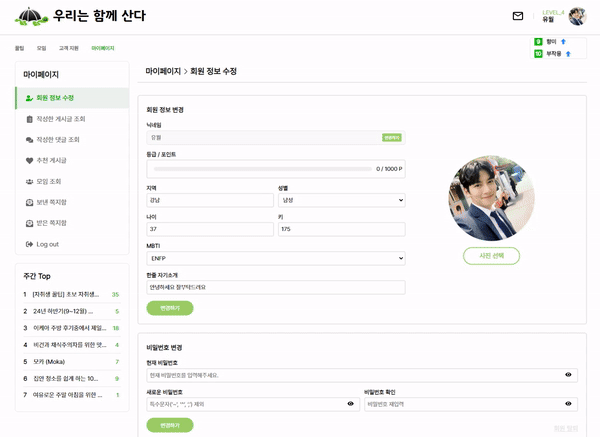
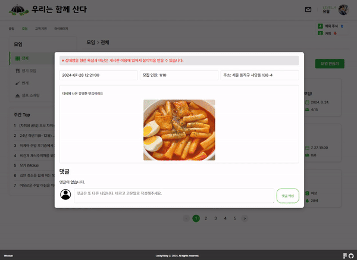

# I. Matching 모임 기능

## Overview
우산 프로젝트의 모임 기능입니다. 로그인 사용자들의 레벨에 따라 모임 기능을 사용 할 수 있습니다.

## APIs
-matchingBoardApi : 모든 모임 조회 / 정기, 번개, 셀프 소개팅 조회 / 정기, 번개, 셀프 소개팅 생성 / 특정 사용자가 작성한 모임 조회 / 모임 수정 / 모임 삭제 / 모임 조회수 관리 
-matchingBoardReplyApi : 댓글 생성, 삭제 / 답글 생성, 삭제 / 특정 모임 댓글 답글 조회
-memberMatchingApi : 모임 가입 요청 / 모임 가입 요청 취소 / 가입 승인, 거절 / 모임 탈퇴 / 모임원 강퇴 / 모임원 리스트 조회 / 모임 가입 요청 리스트 조회 / 

### 구현 기능

- 공통
  - 모임 조회
  - 댓글&답글 등록, 삭제
  
- 모임장
  - 모임 생성, 수정, 삭제
  - 가입 신청 승인, 거절
  - 모임원 강퇴

- 모임원
  - 가입 신청, 취소
  - 모임 탈퇴

## 주요 기능

- Kakao Map API
  - 지도 검색과 키워드 검색을 결합하여 모임 장소 등록 기능
  
  
  
- Redis를 이용한 조회수 관리
  - Redis에 키와 유효 기간을 설정하여 사용자의 조회 기록을 관리해서 조회수 중복과 조작을 방지하고,
  트래픽이 많아지고 다중 접속 시에도 조회수 업데이트가 실시간으로 정확하게 반영되도록 구현했습니다.

- 자바스크립트 객체를 이용한 모임 구분
  - 필터를 이용한 모임 구분  : 모임 태그 필드를 자바스크립트 객체로 사용하여 다중 필드를 사용하지 않고,
  모임을 대 분류 중 분류로 관리 할 수 있게 만들었습니다. 다중 필드를 사용하는 방식에 비해 데이터 구조의 단순성을 유지하면서,
  확장성과 유지 보수성을 높였습니다.
  
  

  
## 기능 실행화면

*모임 회원제한 화면

*모임 조회 화면

*모임 레벨제한 화면

*모임 생성 화면

*모임 카테고리 화면

*모임 셀소 자동폼 화면

*모임 수정 화면

*모임 삭제 화면

*모임 신청 화면

*모임 관리 화면

