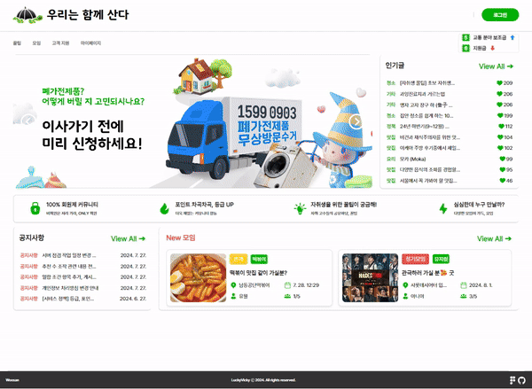
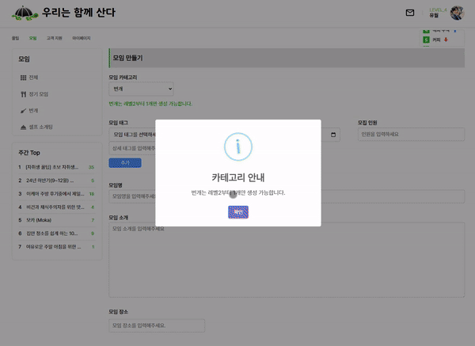
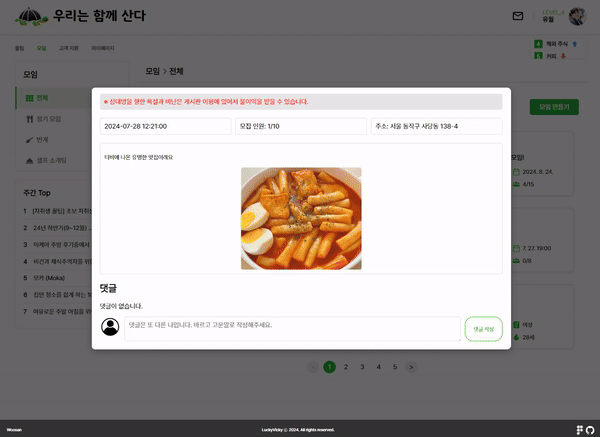
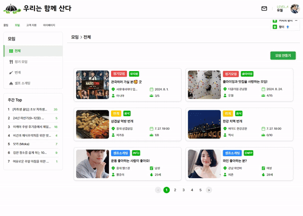

## Features

1. 모임 회원제한 화면
  - 설명 : 비로그인 회원은 모임 페이지 이동불가, 모임 상세보기 불가능

2. 모임 조회 화면
  - 설명 : 전체, 정기모임, 번개, 셀프 소개팅 카테고리별 모임 리스트와 상세 정보 보기 

3. 모임 레벨제한 화면
  - 설명 : 모임 만들기 레벨 제한 (정기모임 : 3이상, 번개, 셀프소개팅 : 2이상) 

4. 모임 생성 화면
  - 설명 : 모임 분류를 위해서 카테고리, 태그 선택과 모임장소 등록에 카카오맵 API가 적용됨

5. 모임 카테고리 화면
  - 설명 : 모임 카테고리에 따른 입력 폼 변경

6. 모임 셀소 자동폼 화면
  - 설명 : 셀프 소개팅 작성 시 마이페이지의 회원 정보가 자동 입력됨

7. 모임 수정 화면
  - 설명 : 모임은 해당 모임장만 내용 수정이 가능함

8. 모임 삭제 화면
  - 설명 : 모임은 해당 모임장만 삭제가 가능함

9. 모임 신청 화면
  - 설명 : 회원은 모임 가입 신청, 취소, 탈퇴가 가능함

10. 모임 관리 화면
  - 설명 : 모임장은 해당 모임에 가입신청 승인, 거절과 기존 모임원 강퇴가 가능함

